## Deployment Evidence

The following screenshots provide proof that the Terraform infrastructure was successfully deployed in Azure.

### Resource Group

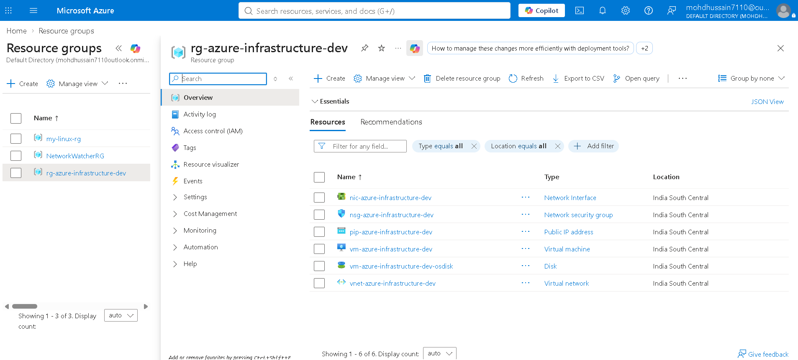

### Virtual Network

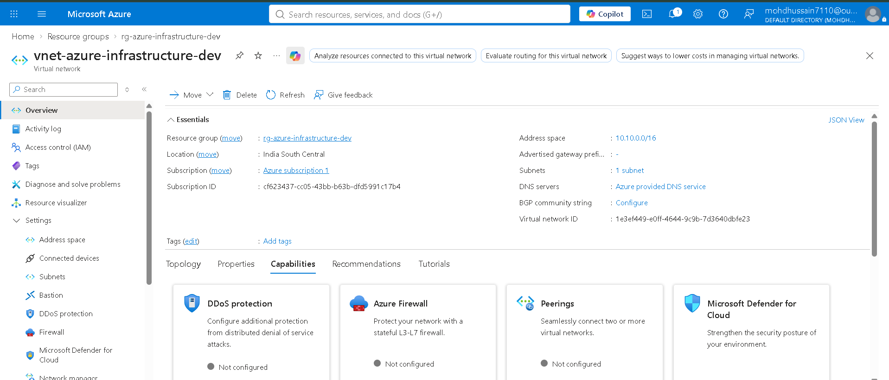

### Network Security Group

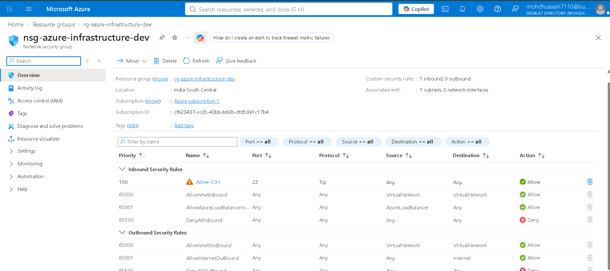

### Network Interface

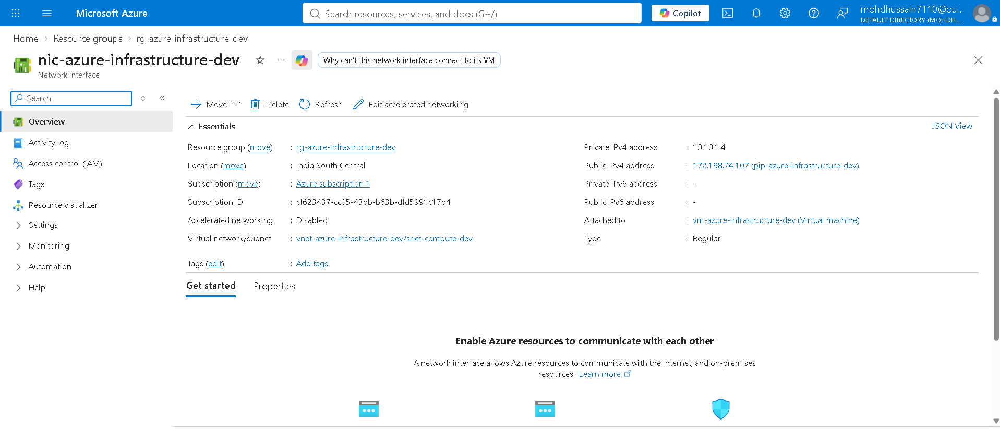

### Virtual Machine

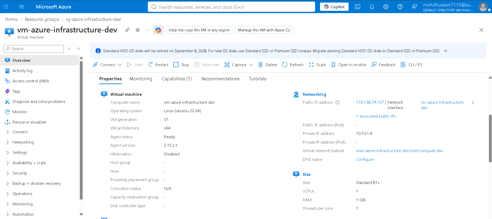

### OS Disk

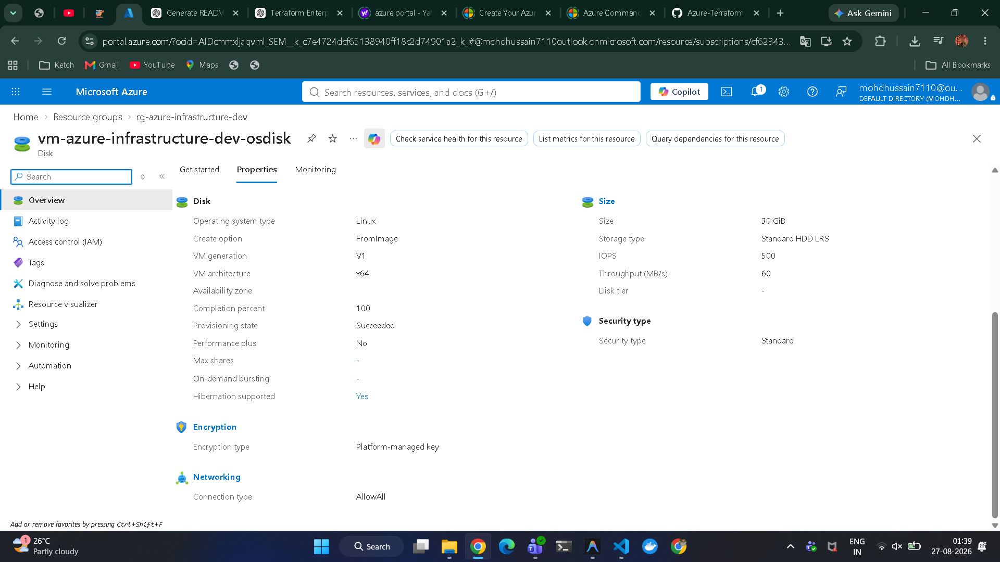

## Count-Based Deployment Evidence

### Resource Group

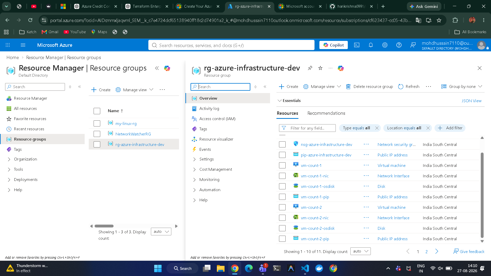

### Network Security Group

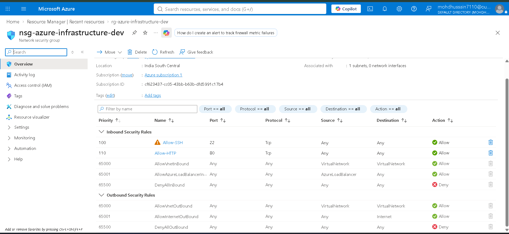

### Virtual Machine

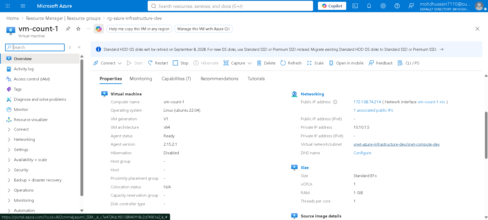

### VM 1 - NGINX

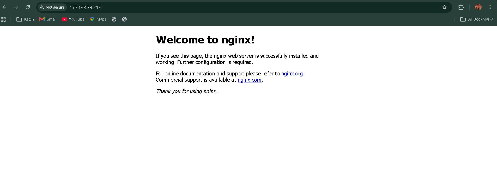

### VM 2

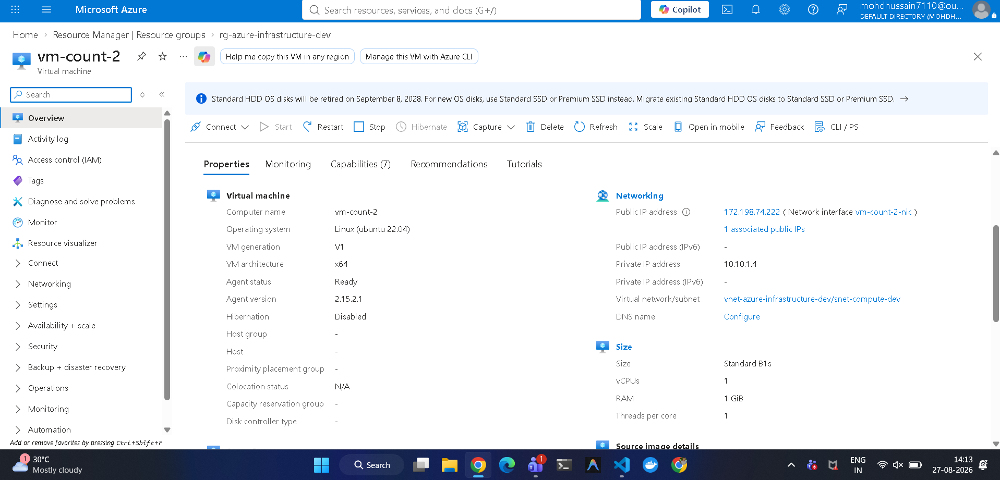

### VM 2 - NGINX

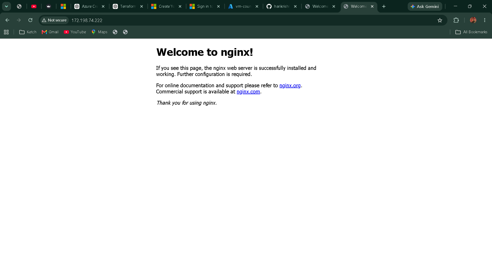

## for_each Deployment Evidence

### Resource Group

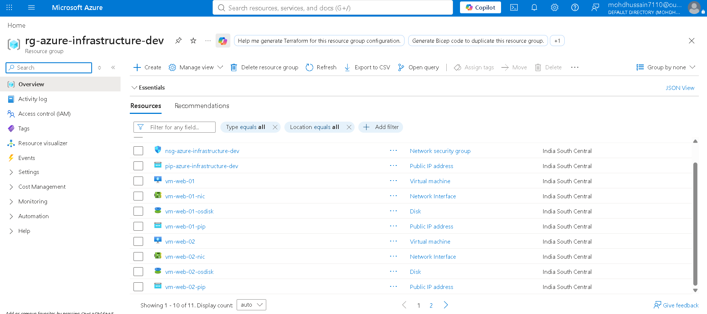

### Network Security Group

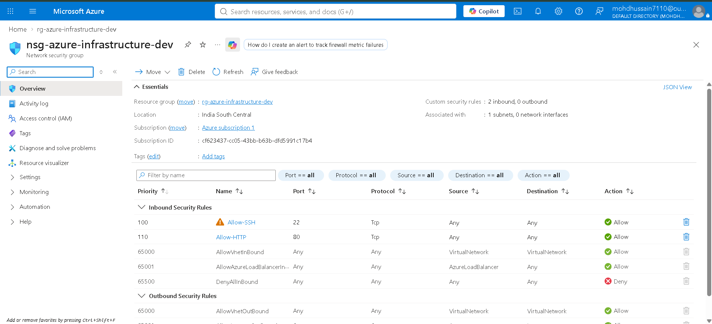

### Virtual Machines

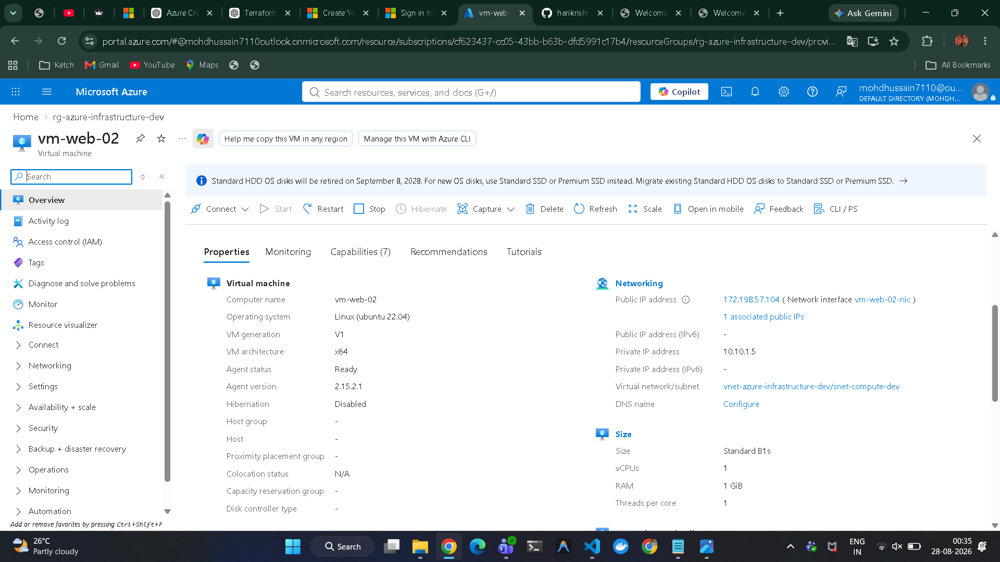

### VM 1

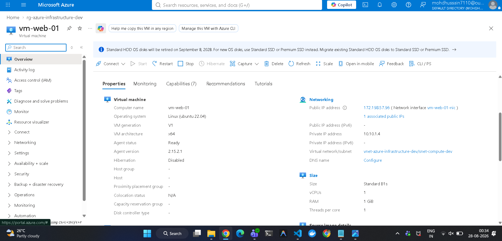

## COUNT AND FOR_EACH

count vs for_each

count is used to create multiple similar resources based on a number and identifies them using numeric indexes.

for_each is used to create multiple individually identifiable resources using meaningful keys, allowing each resource to have its own configuration.

## null_resource

null_resource in Terraform

null_resource is a Terraform resource that does not create any actual infrastructure in the cloud. Instead, it is traditionally used when we want Terraform to run an action or command as part of the infrastructure workflow.

When is it useful?

A common use case is when we need to perform an action after or alongside another Terraform-managed resource, such as:

Running a local script after deployment
Executing a command on a remote machine
Triggering a configuration step
Running an action when specific values change

## VM Routing

When a VM sends traffic, the request first leaves the VM through its Network Interface (NIC) and enters the subnet to which the NIC is attached. Azure then checks the subnet’s effective routes, which include its default system routes and any User Defined Routes (UDRs) associated with that subnet. Based on the matching route, Azure determines the appropriate next hop such as the local VNet, Internet, Azure Firewall, or another network virtual appliance, and forwards the traffic toward its destination.